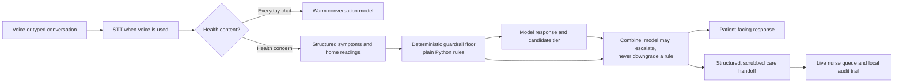

# Companion — bounded AI support for home health conversations

> **All 48 Gate 0 scenarios use synthetic data. No real patient information is included in this repository or its evaluation runs.**

Companion is a hackathon demonstration of an at-home chronic-condition companion that can hold ordinary conversations, notice structured changes, and make its safety reasoning visible to a care team. Its differentiator is simple: an LLM may add caution, but it cannot downgrade a deterministic clinical safety floor.

🎥 **Demo video:** [Watch the 3-minute demo on YouTube](https://youtu.be/OMXcPRwQ5cQ)

## Why the safety boundary matters



The deterministic rules are in [`triage-evidence-pack/src/guardrails.py`](triage-evidence-pack/src/guardrails.py). The live router applies them before and after model interpretation in [`triage-evidence-pack/demo/server/router_adapter.py`](triage-evidence-pack/demo/server/router_adapter.py). Urgent and deferred events are written to the local JSONL audit log by [`triage-evidence-pack/demo/server/main.py`](triage-evidence-pack/demo/server/main.py).

## What is in the demo

- A friendly face for normal conversation, with live Anthropic/ElevenLabs support when configured.
- Plain-code red-flag, ambiguity, and medication-change guardrails.
- A three-window demo: resident face, real-time care-team queue, and evidence page.
- A Gate 0 evaluation harness: 48 synthetic scenarios × 5 repeats, hard safety gates, readability checks, and reproducible reports.

This is a hackathon prototype and safety-evaluation artefact—not a clinical product, diagnosis service, or substitute for emergency care, clinical safety sign-off, or UK medical-device regulation.

## Run from a fresh clone

```bash
git clone <your-GitHub-repository-URL>
cd medical-pa-hackathon/triage-evidence-pack
python3 -m venv .venv
source .venv/bin/activate
pip install -r requirements.txt
cp .env.example .env
```

For the full live experience, add your own Anthropic and ElevenLabs values to `.env`. To rehearse without keys, leave it blank and use mock mode.

On macOS, double-click `Start-Companion-Demo.command` from the repository root. It starts one clean local server and arranges three Chrome windows: face on the left, care team top-right, evidence bottom-right. The pages are also available at:

```text
http://127.0.0.1:8000/face
http://127.0.0.1:8000/nurse
http://127.0.0.1:8000/evidence
```

## Evidence, tests, and cost discipline

```bash
cd triage-evidence-pack
pytest -q                         # 131 tests currently pass
python run_evidence_pack.py --dry-run
python run_evidence_pack.py --preflight --model combined
```

The preflight command estimates provider spend before a real model run using [`config/pricing.yaml`](triage-evidence-pack/config/pricing.yaml). It deliberately labels estimated prices as estimates rather than claiming a fixed pound cost. Real validation records token usage in `results/<run-id>/`; generated results and runtime logs are ignored by Git.

Read the concise methodology and limitations in [`triage-evidence-pack/GATE0_EVALUATION.md`](triage-evidence-pack/GATE0_EVALUATION.md).

## Repository hygiene before publishing

- Copy `.env.example` to `.env`; never add `.env` to Git.
- Run `gitleaks git . --redact=100` from `triage-evidence-pack` before every public push.
- Review `git status` and commit only the showcase code, docs, and tests—not local agent folders, cached voice clips, logs, or generated reports.
- This repository is source-visible for hackathon judging under the proprietary [All Rights Reserved licence](LICENSE). Reuse, redistribution, and derivative work require prior written permission.
